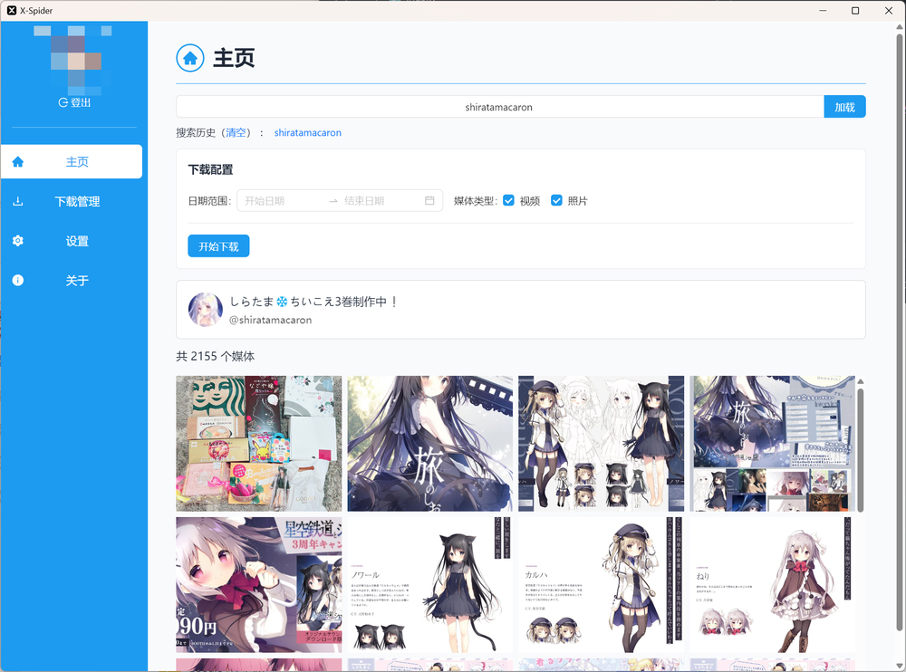
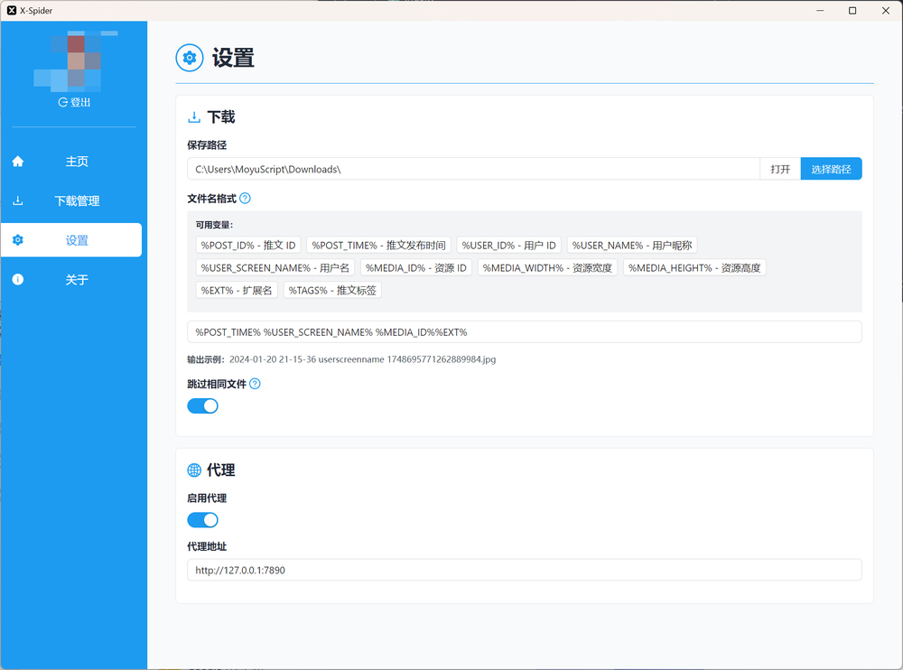
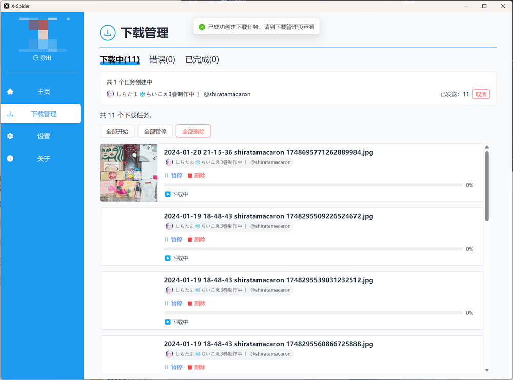

# X-Spider

[](https://github.com/Air6211332/x-spider)
[](https://github.com/Air6211332/x-spider/releases)

[](./LICENSE)

Windows 上的 X（Twitter）媒体下载器，基于 Tauri + React。支持按用户抓取图片、视频、GIF，并管理下载任务。

## 渊源

本仓库基于已归档的开源项目 [MiningCattiva/x-spider](https://github.com/MiningCattiva/x-spider) 继续维护与增强，协议仍为 GPL-3.0。

## 功能

- Cookie 登录
- 手动 / 系统代理
- 媒体过滤（日期范围、类型、帖子/媒体源）
- 跳过已下载文件
- 可配置文件名与保存路径模板
- **我的收藏**：备注名、备注、标签；关键字与标签过滤；打开账号主页
- **自动下载清单**：将账号加入命名清单，一键批量创建下载任务
- **搜索历史**：输入过滤、悬停删除、一键清理过期账号

## 下载

安装包见：[Releases](https://github.com/Air6211332/x-spider/releases)

若暂无可用安装包，可按下方步骤自行构建。

## 本地开发

**环境**

- Windows
- Node.js + [pnpm](https://pnpm.io/)（项目 `packageManager` 为 pnpm@9）
- Rust（用于 Tauri）
- WebView2

**启动**

```bash
pnpm install
pnpm start
```

`pnpm start` 会运行 `tauri dev`（桌面窗口 + 内置 aria2）。请勿只开 `pnpm dev` 用浏览器访问，否则 Aria sidecar 无法启动。

请确保仓库内存在 `src-tauri/binaries` 下的 aria2 可执行文件（Windows：`aria2c-x86_64-pc-windows-msvc.exe`）。

**打包**

```bash
pnpm tauri build
```

## 软件截图







## 许可证

[GPL-3.0](./LICENSE)
